# Qt 自动单元测试Auto Test Project详解


官方：
https://www.qt.io/product/testing-tools
https://doc.qt.io/qt-5/qttestlib-tutorial1-example.html

目录：
[使用 Qt Test 进行 C++ 单元测试 – 第 1 部分 – 简介](https://www.code8cn.com/qt-auto-test-project.html#qt-test1)
[使用 Qt Test 进行 C++ 单元测试 – 第 2 部分 – 高级测试](https://www.code8cn.com/qt-auto-test-project.html#qt-test2)
[使用 Qt Test 进行 GUI 单元测试 – 第 1 部分 – 简介](https://www.code8cn.com/qt-auto-test-project.html#qt-test3)
[使用 Qt Test 进行 GUI 单元测试 – 第 2 部分 – 高级测试](https://www.code8cn.com/qt-auto-test-project.html#qt-test4)

**什么是单元测试？**

单元测试是一个过程，在该过程中可以测试可以与系统逻辑隔离的小段代码。一段代码（称为单元）可以是单独的函数、方法、过程、模块或对象。任务的目的是验证软件代码的每个单元是否按预期执行。单元测试由开发人员在应用程序的开发阶段完成。

**什么是 Qt 测试？**

Qt Test 是 Qt 开发人员发布的一个单元测试框架，用于测试基于 Qt 框架的应用程序或库。它提供了单元测试框架中常见的所有功能以及用于测试图形用户界面的扩展。

**创建 Qt 测试项目**

Qt Creator 方便向导创建用于单元测试的项目。您可以使用“自动测试项目”向导来创建 Qt 测试项目。

- 选择文件 > 新项目 > 其他项目 > 自动测试项目 > 选择创建一个带有样板代码的项目用于 Qt 测试。

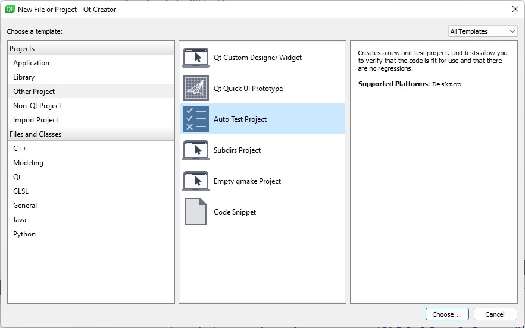

- 在“项目和测试信息”对话框中，指定项目和测试的设置：
  - 在测试框架字段中，选择 Qt 测试。
  - 对于 Qt 测试，选中 GUI Application 复选框以创建 Qt 应用程序。
  - 在“测试用例名称”字段中，输入测试用例的名称。
  - 选中“需要 QApplication”复选框以将 QApplication 的包含语句添加到项目的 main.cpp 文件中。
  - 选中“生成初始化和清理代码”复选框以向您的测试添加函数，这些函数由测试框架执行以初始化和清理测试。
  - 选择用于构建项目的构建系统：qmake、CMake 或 Qbs。

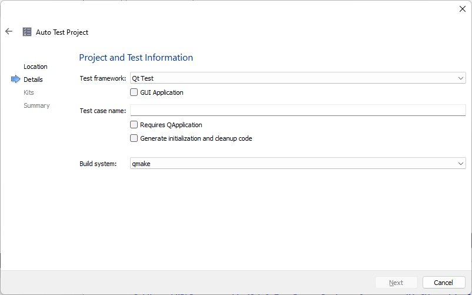

Qt Creator 在指定的项目目录中创建测试项目。编辑 .cpp 文件，为测试中的每个测试函数添加专用插槽。

**创建测试**创建一个测试，子类 QObject 并在您的测试类中添加一个或多个私有插槽。每个私有插槽都是您测试中的一个测试函数。此外，您可以定义以下不被视为测试函数的私有插槽。如果存在，它们将由测试框架执行，可用于初始化和清理整个测试或当前测试功能。

- **initTestCase** () 将在第一个测试函数执行之前被调用。
- **initTestCase_data** () 将被调用来创建一个全局测试数据表。
- **cleanupTestCase** () 将在最后一个测试函数执行后被调用。
- **init** () 将在每个测试函数执行之前被调用。
- **cleanup** () 将在每个测试函数之后调用。

每个测试都应使系统处于可用状态，以便可以重复运行。清理操作应在 cleanupTestCase() 中处理，因此即使测试失败，它们也会运行。

**QTest 命名空间**Qt 测试框架提供 QTest 命名空间和 QAbstractItemModelTester、QSignalSpy 类来为单元测试提供各种函数和声明。 

- QTest – 所有公共方法都在 QTest 命名空间中。 
- QSignalSpy – 启用 Qt 的信号和插槽的自省。
- QAbstractItemModelTester – 允许对项目模型进行非破坏性测试。

**最后….**我对很多理论感到筋疲力尽。所以让我们在这里打破它，我们在下一个会话中会见一些有趣的例子，以便更好地理解。

### 使用 Qt Test 进行 C++ 单元测试 – 第 1 部分 – 简介

本教程介绍了使用 Qt Test 进行 C++ 单元测试。详细讨论和分析了一个工作示例。提供了完整的 qmake 项目和 C++ 源代码。

##### 使用 Qt Test 进行 C++ 单元测试

Qt Test 是一个用于 C++ 单元测试的框架。它是 Qt 的一部分，这意味着它包括测试 Qt GUI 和其他 Qt 元素（如信号）的功能，但它也可用于测试普通（非 Qt）C++ 代码。

在本教程中，我将解释如何使用 Qt Test 来测试 C++ 类。这将涉及创建项目、定义单元测试和使用可用于测试代码的不同宏。

##### 设置项目

Qt Test 背后的想法是每个测试用例都需要是一个独立的可执行文件，并且需要自己的项目。

创建项目的最快方法是使用“自动测试项目”模板，该模板列在“新建项目”对话框的“其他项目”组中。

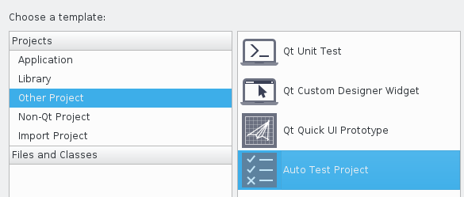

该向导将指导您完成项目的设置。特别是详细信息部分将允许您指定几个选项。

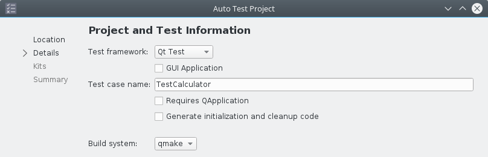

“测试用例名称”将是代表单元测试的类的名称。

如果您不想使用项目向导，则需要将*testlib*添加到您的 qmake 项目文件中的*QT变量中：*

```
QT += testlib
```

如果您的单元测试不涉及任何 GUI 元素，则可以禁用*gui*模块：

```
QT -= gui
```

##### 编写单元测试

要使用 Qt 编写 C++ 单元测试，您需要创建一个继承自*QObject*并实现至少一个私有插槽的类。每个私人插槽都是一个独立的测试。

最简单的单元测试类是这样的：

```
#include <QtTest>
class TestMinimal : public QObject
{
    Q_OBJECT
private slots:
    void testFoo();
};
```

您还可以实现 4 个特殊的专用插槽，用于初始化和清理操作：

```
// called before the first test function
void initTestCase();
// called before every test function
void init();
// called after every test function
void cleanup();
// called after the last test function
void cleanupTestCase();
```

此外，您可以在测试类中拥有所需的所有数据和函数，因为它只是一个普通的 C++ 类。

##### 一个示例单元测试类

对于本教程，我编写了一个简单的示例类进行测试，称为*Calculator*。此类对 2 个整数执行基本的数学运算。没什么特别的，毕竟这只是一个例子。

要记住的一件事是，通常您不会将代码直接包含在单元测试项目中进行测试，但您将测试来自另一个项目的一些库或代码。由于这是一个示例，我们现在可以保持简单。

单元测试类是：

```
#include "Calculator.h"
#include <QtTest/QtTest>
class TestCalculator: public QObject
{
    Q_OBJECT
private slots:
    // -- setup/cleanup --
    void init();
    // -- tests --
    void testConstructor();
    void testSum();
private:
    const int A0 = 0;
    const int B0 = 0;
private:
    Calculator mCalc;
};
```

*TestCalculator*的不同功能将在下一节中解释。

##### 验证值

Qt Test 提供了不同的宏来检查测试过程中的一切是否符合预期。

您可以执行的最简单的检查是验证语句是否为真。为此，您可以使用 *QVERIFY*宏：

```
void TestCalculator::testConstructor()
{
    // default values
    Calculator c1;
    QVERIFY(c1.getA() == 0);
    QVERIFY(c1.getB() == 0);
```

在这段代码中，只要函数 getA() 和 getB() 返回 0，一切都很好。如果是这种情况，您将在运行测试时看到此消息：

```
PASS : TestCalculator::testConstructor()
```

如果失败，消息将通知您出现问题：

```
FAIL! : TestCalculator::testConstructor() 'c1.getA() == 0' returned FALSE. ()
   Loc: [../QtTestIntroduction/TestCalculator.cpp(16)]
```

错误消息没有提供有关问题所在的太多信息。它只告诉你什么表达式是假的。

如果您需要为检查添加一点上下文，您可以使用宏的第二个版本*QVERIFY2*，它允许添加错误消息：

```
    // full constructor
    const int A = 10;
    const int B = 2;
    Calculator c2(A, B);
    QVERIFY2(c2.getA() == A, "first operand doesn't match");
    QVERIFY2(c2.getB() == B, "second operand doesn't match");
}
```

如果失败，调试消息将添加传递给宏的额外信息：

```
FAIL! : TestCalculator::testConstructor() 'c2.getB() == B' returned FALSE. (second operand doesn't match)
 Loc: [../QtTestIntroduction/TestCalculator.cpp(25)]
```

错误消息可能看起来像是额外的工作，但它会帮助不熟悉您的代码的人。您应该始终更喜欢*QVERIFY2*（而不是*QVERIFY*）在测试中包含额外信息。

Qt Test 还提供了其他版本的*QVERIFY*，它们提供了一些额外的功能。例如 *QTRY_VERIFY_WITH_TIMEOUT*或*QVERIFY_EXCEPTION_THROWN*。前者让您在认为条件错误之前多次测试条件。后者检查是否抛出了特定异常。有关更多信息，请查看本教程末尾的参考资料。

##### 比较值

如果您在测试失败时需要更多信息并且想要比较任何类型的值，那么您需要的是*QCOMPARE*：

```
void TestCalculator::testSum()
{
    // sum default
    QCOMPARE(mCalc.Sum(), A0 + B0);
```

该宏将使用最合适的测试运算符比较 2 个参数。例如，为了比较浮点数，它使用 Qt 函数 *qFuzzyCompare()*。

当*QCOMPARE*失败时，它会提供更详细的信息：

```
FAIL! : TestCalculator::testSum() Compared values are not the same
Actual (mCalc.Sum()): 10
Expected (A0 + B0) : 12
 Loc: [../QtTestIntroduction/TestCalculator.cpp(39)]
```

在这种情况下，您还将了解返回值和预期值是什么。在许多情况下非常有用的东西。

*QCOMPARE*也有不同的版本来提供额外的功能，比如*QTRY_COMPARE_WITH_TIMEOUT*，它会在认为条件为假之前多次测试条件。有关更多信息，请查看本教程末尾的参考资料。

##### 应用主要

如前所述，每个单元测试都应该是一个独立的可执行文件。这意味着在创建单元测试后，您需要一个 main 来运行它。

Qt Test 提供了 3 个宏来根据您的需要生成一个 main：

```
// full Qt application
QTEST_MAIN(TestName)
// core Qt application: no GUI, but event loop is available
QTEST_GUILESS_MAIN(TestName) 
// no Qt application: no GUI and no events
QTEST_APPLESS_MAIN(TestName)
```

您可以在定义单元测试的 cpp 文件末尾添加这些宏之一。对于这个例子，我使用了：

```
QTEST_APPLESS_MAIN ( TestCalculator )
```

因为我正在测试纯 C++ 代码（没有 Qt）。

要记住的一件事是，如果您直接在 .cpp 文件（没有 .h 文件）中声明单元测试类，则需要在末尾添加一个额外的包含：

```
QTEST_APPLESS_MAIN(TestCalculator)
#include "TestCalculator.moc"
```

这是 Qt 正常工作所必需的。

##### 源代码

本教程的完整[源代码](https://github.com/vivaladav/BitsOfBytes/tree/master/cpp-unit-testing-with-qt-test-introduction)可在 GitHub 上获得，并在 Unlicense 许可下发布。

##### 参考

要了解有关 Qt Test 的更多信息，您可以查看 [QTest 命名空间](http://doc.qt.io/qt-5/qtest.html)的最新文档。

如果您想了解有关 Qt 的更多信息，请查看我发布的其他Qt 教程。

## 结论

Qt Test 是一个简单易用的框架，用于编写 C++ 单元测试。它没有提供其他类似框架的所有功能，但在许多情况下就足够了。

如果您的项目不涉及 Qt，那么您可能应该选择其他选项。如果您正在使用 Qt，那么 Qt Test 可能是您的最佳选择，特别是如果您想测试 GUI 代码，这是我将在下一篇文章中讨论的内容。

### 使用 Qt Test 进行 C++ 单元测试 – 第 2 部分 – 高级测试

本教程探讨了使用 Qt Test 进行 C++ 单元测试的更高级主题。详细讨论和分析了一个工作示例。提供了完整的 qmake 项目和 C++ 源代码。

##### 使用 Qt Test 进行更多 C++ 单元测试

在本教程中，我将介绍用于 C++ 单元测试的 Qt 框架 Qt Test 的更高级功能。特别是，我将解释如何处理具有多个单元测试的项目以及如何实施数据驱动测试。我还将提供更多测试宏的示例，并向您展示 Qt Creator 提供的集成。

我建议阅读该系列的前几篇文章，尤其是使用 Qt Test 进行 C++ 单元测试的第一部分，以全面了解我将在这里介绍的新概念。

##### 创建更好的项目

上次我展示了如何使用“自动测试项目”模板创建一个单元测试项目。另一个（稍微高级一点的）选项是“Qt Unit Test”模板：

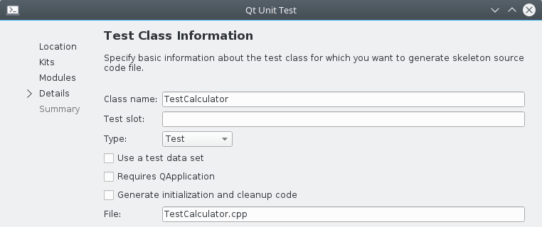

该向导将允许您选择要包含在项目中的 Qt 模块，并将在“详细信息”部分提供更多选项。

正如在第一个教程中看到的那样，Qt 测试的理念是每个测试用例都是一个独立的可执行文件。在实际项目中，您通常有数百甚至数千个不同的单元测试，并且手动运行它们绝对不是一种选择。运行和管理它们的最佳方式是创建一个“父”项目。在这种情况下，正确的选择是“Subdirs Project”模板，它列在“New Project”对话框的“Other Project”组中。

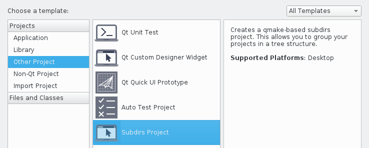

创建项目后，您将返回模板对话框以创建第一个要包含的项目。您可以取消它并继续添加现有项目。最后你会得到这样的东西：

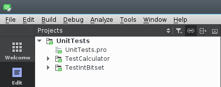

对于本教程，我扩展了 TestCalculator 单元测试项目，并创建了一个名为 TestIntBitset 的新项目。新项目测试了一个简化的 bitset 实现。再次，为了简单起见，要测试的代码（IntBitset 类）包含在单元测试项目中。

##### 数据驱动测试

Qt Test 的一个高级特性是数据驱动测试。这个想法是将测试和数据分开，以避免拥有一长串类似的 *QVERIFY*或*QCOMPARE*宏，并复制初始化测试所需的所有代码。

要向测试函数提供数据，您必须创建另一个与函数同名的私有插槽并添加“ *_data* ”后缀。例如 testDiff() 的数据函数 *是*testDiff_data *()*。

实现数据函数有点像将数据插入数据库。首先，您定义数据，就像定义表一样：

```
void TestCalculator::testDiff_data()
{
    QTest::addColumn<int>("a");
    QTest::addColumn<int>("b");
    QTest::addColumn<int>("result");
```

然后添加值行：

```
    QTest::newRow("all 0") << 0 << 0 << 0;
    QTest::newRow("same number") << 10 << 10 << 0;
    // ... more data ...
}
```

每行包含一个名称和一个值列表。你可以想象前面的代码被转换成如下表的样子：

| INDEX | NAME          | a    | b    | result |
| :---- | :------------ | :--- | :--- | :----- |
| 0     | “all 0”       | 0    | 0    | 0      |
| 1     | “same number” | 10   | 10   | 0      |

一旦我们定义了数据函数，我们就可以编写分为两部分的测试函数。

第一部分检索数据：

```
void TestCalculator::testDiff()
{
    // retrieve data
    QFETCH(int, a);
    QFETCH(int, b);
    QFETCH(int, result);
    // set value
    mCalc.SetA(a);
    mCalc.SetB(b);
```

第二部分使用数据执行检查：

```
    // test
    QCOMPARE(mCalc.Diff(), result);
}
```

如果没有数据驱动的方法，我们应该多次重复设置值和*QCOMPARE*检查的说明。

当执行数据驱动测试时，每组数据都会调用一次测试函数，日志消息如下所示：

```
PASS : TestCalculator::testDiff(all 0)
PASS : TestCalculator::testDiff(same number)
... more lines ...
```

如您所见，日志中报告了数据行的名称，以帮助您区分案例。

##### 其他有用的宏

Qt Test 提供了一些额外的宏来帮助您处理单元测试中的不同情况。

##### 考试不及格

这些宏之一是*QFAIL*，它使当前测试失败。当您知道某些事情会使测试失败时，可以使用它。在这种情况下，浪费时间执行测试是没有意义的，你可以失败并继续前进。

```
void TestIntBitset::initTestCase()
{
    if(sizeof(int) != 4)
        QFAIL("Int size is not 4 on this platform.");
}
```

在我的示例项目中，我在*initTestCase*和*cleanupTestCase函数中使用了**QFAIL*，它们是在执行测试函数之前和之后执行的特殊函数。当 *initTestCase*失败时，不会执行测试用例中的任何测试。

##### 单次检查失败

如果您知道某个特定的*QVERIFY*或*QCOMPARE* 将失败，但您仍想继续执行测试，您可以先使用宏*QEXPECT_FAIL*进行检查：

```
void TestIntBitset::testSetOff()
{
  mBS.setAllOn();
  unsigned int bitsOff = 0;
  mBS.setBitOff(BITS_IN_BYTE * bitsOff++);
  mBS.setBitOff(BITS_IN_BYTE * bitsOff++);
  QEXPECT_FAIL("", "isAnyOff not implemented yet", Continue);
  QVERIFY(mBS.isAnyOff());
  // ... more test code ...
}
```

它的第一个参数在做数据驱动测试时标识一行数据，但在正常测试时可以设置为空字符串。第二个是日志消息，第三个让您决定是要继续还是中止失败的测试。

运行之前的测试时，输出日志将显示如下内容：

```
XFAIL  : TestIntBitset::testSetOff() isAnyOff not implemented yet
   Loc: [../../UnitTests/TestIntBitset/TestIntBitset.cpp(67)]
```

##### 跳过测试

如果您想跳过一个测试或其中的一部分，您可以使用宏*QSKIP*它将测试标记为已跳过并停止执行：

```
void TestIntBitset::testOperators()
{
    QSKIP("Operators have not been implemented yet...");
}
```

*QSKIP*之后不会执行任何代码，但会执行之前的代码，因此如果任何检查失败，则认为测试失败。

运行跳过的测试将在日志中显示以下文本：

```
SKIP : TestIntBitset::testOperators() Operators have not been implemented yet...
    Loc: [../../UnitTests/TestIntBitset/TestIntBitset.cpp(28)]
```

决定何时使用*QFAIL*和何时使用*QSKIP*有时是有争议的。一般来说，没有一个精确的规则，这完全取决于您的设计选择。就我个人而言，当我提前知道某事会失败并且我想强调这一点时，我倾向于使用 QFAIL，而*当*执行*测试*或其中的一部分并不重要时，我倾向于使用 QSKIP。

##### 警告信息

如果要在测试日志中打印警告消息，可以使用*QWARN*。当您想要通知测试中某些事情没有按预期进行时，此宏会很有用。

```
void TestIntBitset::testSetOff()
{
  mBS.setAllOn();
  unsigned int bitsOff = 0;
  mBS.setBitOff(BITS_IN_BYTE * bitsOff++);
  // ... more test code ...
  // this test will trigger a warning
  if((BITS_IN_BYTE * bitsOff) < BITS_IN_INT)
    QVERIFY(!mBS.isBitOff(BITS_IN_BYTE * bitsOff));
  else
    QWARN("trying to verify bit out of set bounds");
  // ... more test code ...
}
```

在这种情况下，*QVERIFY*检查将失败，因为输入数据在某种程度上是错误的。由于本地代码中可能存在错误而导致测试失败是不公平的，但需要强调这种情况。警告是实现这一目标的好方法。

运行包含警告的测试时，输出日志将显示如下内容：

```
WARNING: TestIntBitset::testSetOff() trying to verify value out of set bounds
   Loc: [../../UnitTests/TestIntBitset/TestIntBitset.cpp(75)]
```

警告消息将始终包含一条消息，并将显示发出警告的位置。

##### Qt Creator 集成

毫不奇怪，Qt Creator 提供了与 Qt Test 的出色集成。

左侧边栏中的面板之一称为“测试”，它显示了在容器项目中找到的所有单元测试。

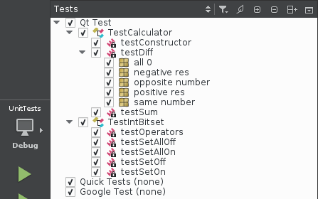

使用此面板，您可以禁用某些测试、全部运行它们或仅运行特定的一个。在进行数据驱动测试时，您还可以选择启用哪些数据集。所有这些在实际项目中都非常有用，您可以有数百甚至数千个单元测试，并且您只需要检查/调试一个/几个。

从测试面板运行单元测试时，结果显示在测试结果面板中，您也可以使用 ALT-8 打开该面板。

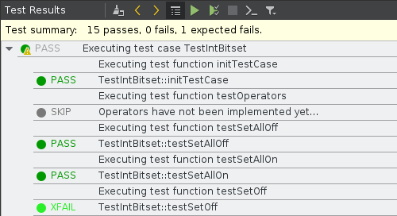

该面板将清楚地显示哪些测试通过，哪些未通过，但它还会显示其他有用的信息，尤其是在失败的情况下。特别是您单击结果以跳转到代码中的任何失败或警告。此外，该面板允许您过滤您希望在日志中看到的事件，例如，您可以只检查失败或警告。

这 2 个面板的组合是对 Qt Creator 和 Qt Test 的一个很好的补充，并免费提供了一个非常强大的工具。

##### 源代码

本教程的完整[源代码](https://github.com/vivaladav/BitsOfBytes/tree/master/cpp-unit-testing-with-qt-test-advanced)可在 GitHub 上获得，并在 Unlicense 许可下发布。

### 使用 Qt Test 进行 GUI 单元测试 – 第 1 部分 – 简介

本教程介绍了使用 Qt Test 进行 GUI 单元测试。详细讨论和分析了一个工作示例。提供了完整的 qmake 项目和 C++ 源代码。

##### 使用 Qt Test 进行 GUI 单元测试

在本教程中，我将介绍使用 Qt Test（用于 C++ 单元测试的 Qt 框架）进行 GUI 单元测试。我将特别讨论如何为小部件类编写基本单元测试、如何模拟鼠标和键盘事件以及如何为 GUI 编写数据驱动测试。

我建议阅读该系列的前几篇文章，以充分理解我将在这里介绍的新概念。

##### 测试一个 QWidget

本教程将讨论一个名为*PanelConcat的**QWidget*类的测试，它表示以下窗口的中央小部件（内容）：

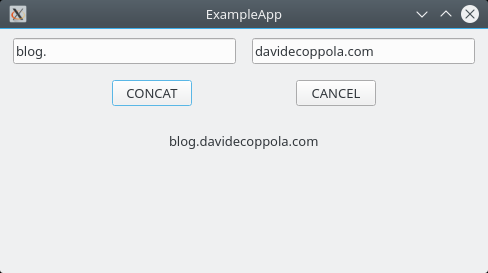

该小部件包含 2 个输入字段和 2 个按钮。按下“CONCAT”按钮将合并 2 个输入字段的字符串并将结果打印到标签上。按下 CANCEL 按钮将清除所有可见数据。没有什么花哨或特别复杂的，但这毕竟只是一个例子。

测试 GUI 代码通常需要与正常单元测试不同的方法。那是因为通常测试小部件的公共功能是不够的。为了正确地测试一个小部件，如果测试器类可以访问它的所有内部数据和函数通常会更好。实现这一目标的最简单方法是让测试类成为被测类的朋友。

对于此示例*PanelConcat*需要像这样修改以提供对*TestPanelConcat*的完全访问权限：

```
class WIDGETSLIBSHARED_EXPORT PanelConcat : public QWidget
{
  Q_OBJECT
  friend class TestPanelConcat;
public:
```

在测试复杂的小部件结构时，可能需要提供对多个测试器类的完整类访问。在这种情况下，一个可能的解决方案是创建一个可供所有测试人员使用的朋友访问者类。

##### 基本 GUI 测试

可以对小部件执行的最简单的测试是检查其所有元素是否已正确创建。

```
void TestPanelConcat::TestConstruction()
{
  QVERIFY2(panel.mInputA, "Input field A not created");
  QVERIFY2(panel.mInputB, "Input field B not created");
  QVERIFY2(panel.mLabelRes, "Result label not created");
}
```

在这种情况下，测试相当简单，因为代码只是检查不同的内部小部件是否不为 NULL。在真实的应用程序中，事情可能会更加复杂，因为某些元素并不总是被创建，因此在单元测试时涵盖所有情况非常重要。

另一个基本的 GUI 测试是检查小部件及其元素的所有重要属性是否正确设置。

```
void TestPanelConcat::TestSize()
{
  QVERIFY2(panel.minimumWidth() == PanelConcat::MIN_W, "Minimum width not set.");
  QVERIFY2(panel.minimumHeight() == PanelConcat::MIN_H, "Minimum height not set");
}
```

在此示例中，TestSize 正在检查是否已设置面板的最小尺寸。

请注意，在这种情况下我没有使用*QCOMPARE*，因为它不适用于另一个类中定义的静态 const。一个可能的解决方法是将外部静态 const 分配给本地 const 并将其传递给*QCOMPARE*，但在这种情况下，我决定保持简单并使用 *QVERIFY*。

##### 测试 GUI 使用

使用 Qt Test 进行 GUI 单元测试时，您通常想要测试的是正常的 GUI 使用情况。这意味着测试您的小部件如何响应鼠标和键盘事件。

Qt Test 提供了几个函数以编程方式向*QWidgets*发送键盘或鼠标事件。

本段中的代码将模拟以下操作：

1. 在 2 个输入字段中写入
2. 按下 CONCAT 按钮以获得结果
3. 按下 CANCEL 按钮清除所有数据

此测试的预期结果是在其末尾看到空输入字段和结果标签。

第一步是使用函数 *QTest::keyClicks*执行的，该函数模拟小部件上的一系列键单击：

```
void TestPanelConcat::TestClear()
{
  // write into input fields
  QTest::keyClicks(panel.mInputA, STR1);
  QTest::keyClicks(panel.mInputB, STR2);
```

键序列在*QString*中编码。例如，字符串“www”表示小部件将收到 3 次“w”键点击。

第二步是使用函数 *QTest::mouseClick*执行的，该函数模拟鼠标单击小部件：

```
  // click button CONCAT
  QTest::mouseClick(panel.mButtonConcat, Qt::LeftButton);
  // click button CANCEL
  QTest::mouseClick(panel.mButtonCancel, Qt::LeftButton);
```

默认情况下 *QTest::mouseClick*模拟小部件中间的单击，这对于按钮来说很好，但也可以指定位置。

最后一步只是验证小部件中的所有文本是否为空。

```
  // check all fields are empty
  QVERIFY2(panel.mInputA->text().isEmpty(), "Input A not empty");
  QVERIFY2(panel.mInputB->text().isEmpty(), "Input B not empty");
  QVERIFY2(panel.mLabelRes->text().isEmpty(), "Label result not empty");
}
```

##### 数据驱动测试

使用 Qt Test 进行 GUI 单元测试的更高级方法是数据驱动测试。这个想法是将测试和数据分开，以避免拥有一长串类似的 *QVERIFY*或*QCOMPARE*宏，并复制初始化测试所需的所有代码。

要向测试函数提供数据，您必须创建另一个与函数同名的私有插槽并添加“ *_data* ”后缀。例如 TestConcat() 的数据函数 *是*TestConcat_data *()*。

实现数据函数有点像将数据插入数据库。首先，您定义数据，就像定义表一样：

```
void TestPanelConcat::TestConcat_data()
{
  QTest::addColumn<QTestEventList>("inputA");
  QTest::addColumn<QTestEventList>("inputB");
  QTest::addColumn<QString>("result");
```

前 2 个“列”的类型是 *QTestEventList*，它是键盘或鼠标事件的列表。

在这种情况下，我在两个列表中存储了 2 个包含按键点击的字符串

```
  QTestEventList listA;
  QTestEventList listB;
  // -- Normal A + B --
  listA.addKeyClicks(STR1);
  listB.addKeyClicks(STR2);
```

最后将一行数据添加到数据集中：

```
  QTest::newRow("Normal A + B") << listA << listB << STR_RES;
  // ... more data ...
}
```

每行包含一个名称和一个值列表。你可以想象前面的代码被转换成如下表的样子：

| INDEX | NAME           | inputA | inputB | result  |
| :---- | :------------- | :----- | :----- | :------ |
| 0     | “Normal A + B” | listA  | listB  | STR_RES |

一旦我们定义了数据函数，我们就可以编写分为 3 部分的测试函数。

第一部分使用宏*QFETCH*检索数据或行：

```
void TestPanelConcat::TestConcat()
{
  QFETCH(QTestEventList, inputA);
  QFETCH(QTestEventList, inputB);
  QFETCH(QString, result);
```

然后该数据用于模拟与小部件的一些交互。特别是函数 *QTestEventList::simulate*在目标小部件上一一模拟事件列表中的事件：

```
  // write into input fields
  inputA.simulate(panel.mInputA);
  inputB.simulate(panel.mInputB);
  // click button CONCAT
  QTest::mouseClick(panel.mButtonConcat, Qt::LeftButton);
```

最后一部分检查发生了什么：

```
  // compare result
  QCOMPARE(panel.mLabelRes->text(), result);
}
```

例如，此代码测试结果标签是否包含正确的结果字符串。

如果没有数据驱动的方法，我们应该在代码中多次重复这 3 个步骤。

##### 源代码

本教程的完整[源代码](https://github.com/vivaladav/BitsOfBytes/tree/master/gui-unit-testing-with-qt-test-introduction)可在 GitHub 上获得，并在 Unlicense 许可下发布。

完整的项目结构包括 3 个子项目：

- **WidgetsLib** – 一个包含小部件类的动态库。
- **ExampleApp – 使用***PanelConcat*小部件的示例应用程序。
- **TestPanelConcat –** *PanelConcat*的单元测试。

要尝试该示例，请在 Qt Creator 中加载名为**GuiUnitTestingIntro的顶级子目录项目。**

请记住，默认情况下，运行项目将启动示例应用程序。要运行单元测试，您可以更改活动运行配置，使用测试面板或使用菜单

```
工具 > 测试 > 运行所有测试
```

##### 参考

要了解有关本教程中介绍的概念的更多信息，您可以查看 [QTest 命名空间](http://doc.qt.io/qt-5/qtest.html)的最新文档。

如果您想了解有关 Qt 的更多信息，请查看我发布的其他Qt 教程。

##### 结论

如本教程所示，使用 Qt Test 进行 GUI 单元测试是一种具体的可能性，Qt 开发人员在处理 Qt 代码时应该考虑到这一点。测试与用户界面的每一个可能的交互肯定不是微不足道的，但覆盖大部分肯定是可能的，Qt Test 提供了足够的支持。

在本系列的下一篇也是最后一篇文章中，我将讨论使用 Qt Test 进行更高级的 GUI 单元测试。特别是，我将讨论如何模拟涉及焦点和信号的更复杂的小部件交互。

### 使用 Qt Test 进行 GUI 单元测试 – 第 2 部分 – 高级测试

本教程探讨了使用 Qt Test（用于 C++ 单元测试的 Qt 框架）进行 GUI 单元测试的更高级主题。详细讨论和分析了一个工作示例。提供了完整的 qmake 项目和 C++ 源代码。

##### 使用 Qt Test 进行更多 GUI 单元测试

本教程将介绍专门用于 GUI 单元测试的 Qt Test 的更高级功能。特别是它将展示如何模拟和处理键盘焦点以及如何在对图形用户界面进行单元测试时测试 Qt 信号。

我建议阅读该系列的前几篇文章，尤其是第一部分使用 Qt Test 进行 GUI 单元测试，以全面了解我将在这里介绍的新概念。

##### 测试一个 QWidget

本教程将继续测试第 1 部分中介绍的*QWidget*：


该小部件包含 2 个输入字段和 2 个按钮。按下“CONCAT”按钮将合并 2 个输入字段的字符串并将结果打印到标签上。按下 CANCEL 按钮清除所有数据。

与第 1 部分中实现的小部件的唯一区别是，这个新版本在每次按下按钮时都会发出一个信号。这是为了试验信号测试，你很快就会读到。

##### 测试重点

当使用 Qt Test 测试焦点时，我们基本上是在模拟用户使用键盘与我们的小部件进行交互。

使用焦点时需要考虑的重要一点是，在小部件上简单地调用*QWidget::setFocus*将不起作用，因为在执行测试期间小部件不可见。我们需要做的是在我们正在测试的*QWidget上调用静态函数**QApplication::setActiveWindow ，在本例中是**PanelConcat*对象：

```
void TestPanelConcat::TestFocus()
{
  // enables focus and widget events
  QApplication::setActiveWindow(&panel);
```

从现在开始，焦点事件将成功传送到我们的小部件。

测试小部件时要采取的额外步骤是使用 *QWidget::setFocus*设置最初将保持焦点的元素：

```
  // set initial focus
  panel.mInputA->setFocus();
  QVERIFY2(panel.mInputA->hasFocus(), "Input A doesn't have focus");
```

在验证焦点设置正确后，我们可以继续进行模拟。

这个动画 GIF 显示了我们想要模拟的内容。请注意小部件元素周围的蓝色突出显示焦点所在的位置。

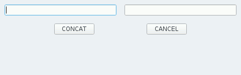

以下代码使用第 1 部分中介绍的 *QTest::keyClicks*函数写入 2 个输入字段。要从一个字段移动到另一个字段，代码模拟了 TAB 键的按下，默认情况下将焦点移动到下一个小部件焦点链。最后，焦点移到用 SPACE 键按下的 CONCAT 按钮上。

```
  // write STR1
  QTest::keyClicks(QApplication::focusWidget(), STR1);
  // move focus to next widget
  QTest::keyClick(&panel, Qt::Key_Tab);
  QVERIFY2(panel.mInputB->hasFocus(), "Input B doesn't have focus");
  // write STR2
  QTest::keyClicks(QApplication::focusWidget(), STR2);
  // move focus to next widget
  QTest::keyClick(&panel, Qt::Key_Tab);
  QVERIFY2(panel.mButtonConcat->hasFocus(), "Button CONCAT doesn't have focus");
  // press button CONCAT using space
  QTest::keyClick(QApplication::focusWidget(), Qt::Key_Space);
  QCOMPARE(panel.mLabelRes->text(), STR_RES);
```

整个模拟的预期结果是读取合并在结果标签中的 2 个字符串。

测试的最后一部分会将焦点移到 CANCEL 按钮并按下它：

```
  // move focus to next widget
  QTest::keyClick(&panel, Qt::Key_Tab);
  QVERIFY2(panel.mButtonCancel->hasFocus(), "Button CANCEL doesn't have focus");
  // press button CANCEL using space
  QTest::keyClick(QApplication::focusWidget(), Qt::Key_Space);
  QVERIFY2(panel.mInputA->text().isEmpty(), "Cancel didn't work on input A");
  QVERIFY2(panel.mInputB->text().isEmpty(), "Cancel didn't work on input B");
  QVERIFY2(panel.mLabelRes->text().isEmpty(), "Cancel didn't work on res label");
}
```

预期结果是输入字段和结果标签中的空文本。

为了简单起见，我在一个函数中测试了两个按钮的行为，但是在编写真正的单元测试时，最好保持独立。因此，在现实世界中，最好将此测试拆分为两个功能。

##### 测试信号

Qt 的一个关键特性是基于信号和槽的对象通信，它基本上是一个基于事件的系统。

为了测试这一点，Qt Test 提供了一个名为*QSignalSpy 的类，* 它是一个可以拦截和记录信号的类固醇*QList*。

正如介绍中所预期的，*PanelConcat*类发出两个信号：

- **DataAvailable(QString)** – 在 CONCAT 被推送并且输入文本被合并后发出。
- **DataCleared()** – 在 CANCEL 被按下并清除所有文本后发出。

在下面的测试中，代码将模拟两个按钮的按下并检查发出的信号。

为简单起见，代码的第一部分直接在输入字段中设置文本。然后它创建两个 *QSignalSpy对象，每个对象都与**面板*对象发出的信号相关联：

```
void TestPanelConcat::TestSignals()
{
  // set input
  panel.mInputA->setText(STR1);
  panel.mInputB->setText(STR2);
  // create spy objects
  QSignalSpy spy1(&panel, &PanelConcat::DataAvailable);
  QSignalSpy spy2(&panel, &PanelConcat::DataCleared);
```

第二部分模拟按下 CONCAT 按钮，然后检查是否记录了*DataAvailable*信号。*这样做就像检查相应的QSignalSpy*对象 ( *spy1* ) 包含多少项目一样简单。然后最后一个*QCOMPARE*检查从信号接收到的参数是否对应于结果字符串*。*

```
  // click button CONCAT
  QTest::mouseClick(panel.mButtonConcat, Qt::LeftButton);
  QCOMPARE(spy1.count(), 1);
  QCOMPARE(spy2.count(), 0);
  QList args = spy1.takeFirst();
  QCOMPARE(args.at(0).toString(), STR_RES);
```

测试函数的最后一部分模拟按下 CANCEL 按钮并检查是否接收到*DataCleared*信号并且它不携带任何参数。

```
  // click button CANCEL
  QTest::mouseClick(panel.mButtonCancel, Qt::LeftButton);
  QCOMPARE(spy1.count(), 0);
  QCOMPARE(spy2.count(), 1);
  args = spy2.takeFirst();
  QVERIFY2(args.empty(), "DataCleared signal has parameters now?!?");
}
```

在这个例子中，为了简单起见，我在 1 个测试中测试了*PanelConcat*的 2 个信号，但最好在 2 个不同的测试中保持隔离。在编写真正的单元测试时请记住这一点。

## 源代码

本教程的完整[源代码](https://github.com/vivaladav/BitsOfBytes/tree/master/gui-unit-testing-with-qt-test-advanced)可在 GitHub 上获得，并在 Unlicense 许可下发布。

完整的项目结构包括 3 个子项目：

- **WidgetsLib** – 一个包含小部件类的动态库。
- **ExampleApp – 使用***PanelConcat*小部件的示例应用程序。
- **TestPanelConcat –** *PanelConcat*的单元测试。

要尝试该示例，请在 Qt Creator 中加载名为**GuiUnitTestingAdv的顶级子目录项目。**

请记住，默认情况下，运行项目将启动示例应用程序。要运行单元测试，您可以更改活动运行配置，使用测试面板或使用菜单

```
工具 > 测试 > 运行所有测试
```

##### 参考

要了解有关本教程中介绍的概念的更多信息，您可以查看 [QTest 命名空间](http://doc.qt.io/qt-5/qtest.html) 和[QSignalSpy](http://doc.qt.io/qt-5/qsignalspy.html)类的最新文档。

如果您想了解有关 Qt 的更多信息，请查看我发布的其他Qt 教程。

## 结论

为 GUI 编写单元测试通常比“传统”后端/库代码更复杂。这是因为您不能简单地测试公共函数，而且元素之间的联系更紧密。尽管如此，正如您从这篇文章和我之前的文章中看到的那样，使用 Qt Test 可以模拟几乎所有类型的用户交互。