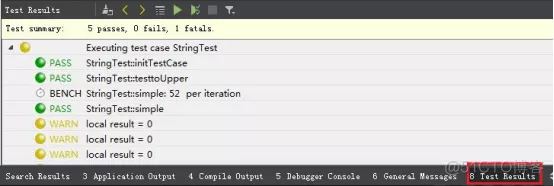

# Qt高级——QTestLib单元测试框架

## 一、QTestLib简介

### 1、QTestLib简介

QTestLib是Qt提供的一种针对基于Qt编写的程序或库的单元测试框架。QTestLib提供了单元测试框架的基本功能，并提供了针对GUI测试的扩展功能。

### 2、QTestLib特性

QTestLib是为了简化QT程序或库的单元测试工作而设计的。
QTestLib特性如下：
A、轻量级：QTestlib只包含6000行代码和60个导出符号
B、自包含：对于非GUI测试，QTestlib只需要Qt核心库的几个符号。
C、快速测试：QTestlib不需要特殊的测试执行程序，不需要为测试而进行特殊的注册。
D、数据驱动测试：一个测试程序可以在不同的测试数据集上执行多次。
E、基本的GUI测试：QTestlib提供了模拟鼠标和键盘事件的功能。
F、基准测试：QTestLIB支持基准测试并提供多种测量后端。
G、IDE友好：QTestlib的输出信息可以被Visual Studio和KDevelop解析。
H、线程安全：错误报告是线程安全的、原子性的。
J、类型安全：对模板进行了扩展使用，防止由隐式类型转换引起的错误。
K、易扩展：用户自定义类型可以容易地加入到测试数据和测试输出中。

### 3、QTestLib API

所有公有的方法都在QTest命名空间中。另外，QSignalSpy类为Qt的信号和槽提供了简单的内省机制。

### 4、AutoTest插件

默认测试结果以纯文本形式显示在控制台（应用程序输出标签），不够直观，可使用AutoTest插件实现可视化效果。
通过Help->About Plugins->Utilities，选中AutoTest，重启Qt Creator，然后在下方会多出TestResults的标签，可直接在此标签点击上方的运行按钮运行所有测试，同时在“Tools-Tests-Run All Tests”也可运行所有测试。
此插件可以在运行单元测试后以红、绿色表示明确标记处运行结果，并且以Case为单位显示，可以展开看到具体每一个测试用例的结果。



## 二、QTestLib单元测试原理

### 1、QTestLib单元测试原理简介

原理：输入测试数据表和结果数据表，与实际值比较。

### 2、测试类

测试类需要从QObject类继承，类中需要加入一个或者多个私有槽。每一个私有槽都是一个测试函数，但有4种私有槽不能作为测试函数，它们由测试框架执行，可为整个测试程序或当前测试函数进行初始化和清除操作。
initTestCase()：在第一个测试函数执行前调用。
cleanupTestCase()：在最后一个测试函数执行后调用。
init()：在每一个测试函数执行前调用。
cleanup()：在每一个测试函数执行后调用。
如果initTestCase()函数执行失败，任何测试函数都不会执行。如果init()函数执行失败，紧随其后的测试函数不会被执行，测试会继续处理下一个测试函数。
QTest::qExec(QObject* testClassObject)函数用于执行测试对象中所有的测试函数。

### 3、测试函数

对于一个要测试的目标函数，需要使用两个函数进行测试:testFunctionName()和testFunctionName_data()。
testFunctionName_data:数据提供，在函数体中写入测试数据。
testFunctionName：测试的实体，读取testFunctionName_data函数中的数据表，并逐行进行测试。如果测试结果与数据表中的结果不同，则认为测试失败。

### 4、测试数据构建

数据由QTest:：addColumn < T > (name)和QTest::newRow(name) << input << result来构建一个数据表，其中的列可以被获取，然后将表中对应的数据按行测试，并与表中的结果列进行对比。

### 5、GUI测试

对于GUI交互操作的测试，则将数据设置为事件列表，供模拟测试。QTestlib提供了模拟鼠标和键盘事件的功能。

### 6、通信

QTest提供一系列宏来进行数据的通信。

```sh
QBENCHMARK
QBENCHMARK_ONCE
QCOMPARE(actual, expected)
QEXPECT_FAIL(dataIndex, comment, mode)
QFAIL(message)
QFETCH(type, name)
QFINDTESTDATA(filename)
QSKIP(description)
QTEST(actual, testElement)
QTEST_APPLESS_MAIN(TestClass)
QTEST_GUILESS_MAIN(TestClass)
QTEST_MAIN(TestClass)
QTRY_COMPARE(actual, expected)
QTRY_COMPARE_WITH_TIMEOUT(actual, expected, timeout)
QTRY_VERIFY2(condition, message)
QTRY_VERIFY(condition)
QTRY_VERIFY2_WITH_TIMEOUT(condition, message, timeout)
QTRY_VERIFY_WITH_TIMEOUT(condition, timeout)
QVERIFY2(condition, message)
QVERIFY(condition)
QVERIFY_EXCEPTION_THROWN(expression, exceptiontype)
QWARN(message)
```

### 7、程序启动入口

QTest提供了QTEST_MAIN()作为测试的启动宏，构建一个main函数，在main函数内调用QTest::qExec(QObject* testClassObject)，也可以直接调用QTest::qExec(QObject* testClassObject)来启动测试。

## 三、简单测试程序

### 1、编写测试程序

假设要测试QString类的行为。首先，需要一个用于包含测试函数的必须从QObject继承的类：

```cp
#include <QtTest/QtTest>

 class TestQString: public QObject
 {
     Q_OBJECT
 private slots:
     void toUpper();
 };
```


注意：需要包含QTest头文件，并且测试函数必须声明为私有槽，便于测试框架找到并执行它们。

```cpp
void TestQString::toUpper()
 {
     QString str = "Hello";
     QVERIFY(str.toUpper() == "HELLO");
 }
```


QVERIFY()宏将计算传入的表达式的值。如果为真，则测试函数继续进行；否则会向测试日志中增加一条描述错误的信息，并且该测试函数会停止执行。
但是如果需要向测试日志中增加更详细的输出信息，应该使用QCOMPARE()宏：

```cpp
void TestQString::toUpper()
 {
     QString str = "Hello";
     QCOMPARE(str.toUpper(), QString("HELLO"));
 }
```


### 2、执行测试程序

写完测试程序后就需要执行测试程序。假设将测试程序命名为testqstring.cpp并保存在一个空目录中，可以使用qmake生成一个工程文件和一个Makefile文件。

```cpp
myTestDirectory$ qmake -project "QT += qtestlib"
	myTestDirectory$ qmake
	myTestDirectory$ make
```


### 3、QTestlib命令行参数

执行自动测试的语法形式：
```
testname [options] [testfunctions[:testdata]]...
```

testname：测试项目的可执行文件
testfunctions：包含要执行的测试函数名，如果不指定testfunctions，所有的测试函数都会执行。如果测试函数名之后加上了测试数据行的名字，则测试函数执行时只会使用该行测试数据。
列如：

```
/myTestDirectory# StringTest toUpper
```

使用所有的测试数据执行toUpper测试函数。

```
/myTestDirectory$ StringTest  toUpper  toInt:zero
```

使用所有的测试数据执行toUpper测试函数，使用行名为zero的测试数据执行toInt测试函数（如果对应的测试数据不存在，相关的测试执行时就会失败）。
```
/myTestDirectory$ WidgetTest  -vs  -eventdelay  500
```

执行WidgetTest测试程序，输出每一个信号发射信息，在每次模拟鼠标/键盘事件之后等待500毫秒。
选项
下列命令行参数可以被接受：
-help
输出命令行参数的帮助信息。
-functions 
输出测试中的所有测试函数。
-o filename 
将输出信息写入到执行文件中，而不是打印到标准输出上。
-silent 
沉默地输出，只显示警告、错误和最少的状态信息。
-v1 
详细输出；输出每次进入或离开测试函数的信息。
-v2 
详细输出；也输出每个QCOMPARE()和QVERIFY()信息。
-vs 
输出发出的所有信号。
-xml 
将输出格式化成XML格式，而不是普通文本
-lightxml 
输出成XML标签流。
-eventdelay ms 
如果键盘或鼠标模拟(QTest::keyClick()，QTest::mouseClick()等)不指定延迟时间，则使用该参数（以毫秒为单位）作为延迟时间。
-keydelay ms
与-eventdelay的作用一样，但只影响键盘模拟的延迟时间，不影响鼠标模拟的延迟时间。
-mousedelay ms 
与-eventdelay的作用一样，但只影响鼠标模拟的延迟时间，不影响键盘模拟的延迟时间。
-keyevent-verbose 
详细输出键盘模拟信息。
-maxwarnings numberBR 
设置警告信息的最大数量，0表示不限制，默认值为2000。

## 四、数据驱动测试程序

### 1、数据驱动测试简介

目前为止，采用硬编码的方式将测试数据写到测试函数中。如果增加更多的测试数据，那么测试函数会变成:

	QCOMPARE(QString("hello").toUpper(), QString("HELLO"));
	QCOMPARE(QString("Hello").toUpper(), QString("HELLO"));
	QCOMPARE(QString("HellO").toUpper(), QString("HELLO"));
	QCOMPARE(QString("HELLO").toUpper(), QString("HELLO"));

为了不使测试函数被重复的代码弄得凌乱不堪， QTestLib支持向测试函数增加测试数据，仅需要向测试类增加另一个私有槽:

```cpp
class TestQString: public QObject
 {
     Q_OBJECT
 private slots:
     void toUpper_data();
     void toUpper();
 }; 
```

### 2、编写测试数据函数

为测试函数提供数据的函数必须与测试函数同名，并加上_data后缀。为测试函数提供数据的函数类似这样:

```cpp
void TestQString::toUpper_data()
 {
     QTest::addColumn<QString>("string");
     QTest::addColumn<QString>("result");

     QTest::newRow("all lower") << "hello" << "HELLO";
     QTest::newRow("mixed")     << "Hello" << "HELLO";
     QTest::newRow("all upper") << "HELLO" << "HELLO";

 }
```


首先，使用QTest::addColumn()函数定义测试数据表的两列元素：测试字符串和在该测试字符串上调用QString::toUpper()函数期望得到的结果。
然后使用 QTest::newRow()函数向测试数据表中增加一些数据。每组数据都会成为测试数据表中的一个单独的行。
QTest::newRow()函数接收一个参数：将要关联到该行测试数据的名字。如果测试函数执行失败，名字会被测试日志使用，以引用导致测试失败的数据。然后将测试数据加入到新行：首先是一个任意的字符串，然后是在该行字符串上调用 QString::toUpper()函数期望得到的结果字符串。
可以将测试数据看作是一张二维表格。在这个例子里，它包含两列三行，列名为string 和result。另外，每行都会对应一个序号和名称:
index name string result
0 all lower “hello” HELLO
1 mixed “Hello” HELLO
2 all upper “HELLO” HELLO

### 3、编写测试函数

测试函数需要被重写：

```cpp
void TestQString::toUpper()
 {
     QFETCH(QString, string);
     QFETCH(QString, result);

     QCOMPARE(string.toUpper(), result);

 }
```


TestQString::toUpper()函数会执行两次，对toUpper_data()函数向测试数据表中加入的每一行都会调用一次。
首先，调用QFETCH()宏从测试数据表中取出两个元素。QFETCH()接收两个参数: 元素的数据类型和元素的名称。然后用QCOMPARE()宏执行测试操作。
使用这种方法可以不修改测试函数就向该函数加入新的数据。
像以前一样，为使测试程序能够单独执行，需要加入下列代码:
QTEST_MAIN(TestGui)
QTEST_MAIN()宏将扩展成一个简单的main()函数，该main()函数会执行所有的测试函数。

## 五、GUI测试

QTestlib单元测试提供GUI操作函数，可对控件发送消息后检测执行结果，比如QTest::keyClick()，QTest::mouseClick()等等

### 1、模拟GUI事件

QTestlib具有测试GUI的一些特性。QTestLib发送内部Qt事件，而不是模拟本地窗口系统事件，因此运行测试程序不会对机器产生任何副作用。

```cpp
#include <QtGui>
#include <QtTest/QtTest>

 class TestGui: public QObject
 {
     Q_OBJECT
 private slots:
     void testGui();
 };
```


唯一的区别是除了要加入QTest命名空间之外，需要包含QtGui类的定义。

```cpp
void TestGui::testGui()
 {
     QLineEdit lineEdit;
     QTest::keyClicks(&lineEdit, "hello world");
     QCOMPARE(lineEdit.text(), QString("hello world"));
 }
```

在测试函数实现中，创建一个QLineEdit，使用QTest::keyClicks()函数模拟在行编辑框中输入“hello world”字符串。
注意: 为了正确测试快捷键，控件必须显示出来。
QTest::keyClicks()在控件上模拟一连串的键盘敲击操作。另外，每次键盘敲击后，可以指定延迟时间（以毫秒为单位）。同样，也可以用 QTest::keyClick()、QTest::keyPress()、QTest::keyRelease()、QTest::mouseClick()、QTest::mouseDClick()、QTest::mouseMove()、QTest::mousePress() 和QTest::mouseRelease()函数来模拟相应的GUI事件。
最后，使用QCOMPARE()宏来检验行编辑框的文本是否与预期的一致。
像前面一样，为使测试程序能够单独执行，需要加入下列代码:

```
QTEST_MAIN(TestGui)
```


QTEST_MAIN()宏将扩展成一个简单的main()函数，该main()函数会执行所有的测试函数。

### 2、重复GUI事件

在本节中，将展示如何模拟GUI事件，以及如何存储一系列GUI事件以及如何在组件上重复这些GUI事件。
将一系列GUI事件保存起来并重复触发的方法与数据驱动测试程序的方法很类似。所要做的只是向测试类增加一个提供测试数据的函数:

```cpp
class TestGui: public QObject
 {
     Q_OBJECT
 private slots:
     void testGui_data();
     void testGui();
 }; 
```


像前面一样，为测试函数提供数据的函数必须与该测试函数同名，并加上_data后缀。

```cpp
void TestGui::testGui_data()
 {
     QTest::addColumn<QTestEventList>("events");
     QTest::addColumn<QString>("expected");

     QTestEventList list1;
     list1.addKeyClick('a');
     QTest::newRow("char") << list1 << "a";
    
     QTestEventList list2;
     list2.addKeyClick('a');
     list2.addKeyClick(Qt::Key_Backspace);
     QTest::newRow("there and back again") << list2 << "";

 }
```


首先，用QTest::addColumn()函数定义测试数据表的元素：一个GUI事件列表，以及在控件上应用该事件列表预期得到的结果。注意第一个元素的类型是QTestEventList。
QTestEventList可以保存将来要使用的GUI事件，并可以在任意控件上重复触发这些事件。
在目前的提供测试数据的函数中，创建了两个QTestEventLists。第一个链表包括了一个敲击“a“键事件，调用QTestEventList::addKeyClick()函数向链表中加入该事件。然后用QTest::newRow()函数给该行数据指定一个名字，并把事件队列和期望结果输入到测试数据表中。
第二个链表包括两次键盘敲击：一个“a“，然后是一个“backspace“。同样用 QTestEventList::addKeyClick()函数将事件加入队列，用QTest::newRow()将事件队列和期望的结果加入测试数据表中，并为该行指定一个名字。

```cpp
void TestGui::testGui()
 {
     QFETCH(QTestEventList, events);
     QFETCH(QString, expected);

     QLineEdit lineEdit;
    
     events.simulate(&lineEdit);
    
     QCOMPARE(lineEdit.text(), expected);

 }
```


TestGui::testGui()函数会执行两次，对在TestGui::testGui_data()函数中创建的每一行测试数据都执行一次。
首先，用QFETCH()宏从测试数据集中取出两个元素。QFETCH()宏接收两个参数：元素的数据类型和元素的名字。然后创建了一个QLineEdit，调用 QTestEventList::simulate()函数在控件上触发事件队列。
最后，用QCOMPARE()宏检测行编辑框的内容是否与期望的一致。
像以前一样，为使测试程序能够单独执行，需要加入下列代码:
QTEST_MAIN(TestGui)
QTEST_MAIN()宏将扩展成一个简单的main()函数，该main()函数会执行所有的测试函数。

## 六、Benchmark测试

为了编写一个基准测试程序，需要使用QBENCHMARK宏来扩展测试函数。一个基准测试函数通常由初始化代码和一个QBENCHMARK宏组成，QBENCHMARK宏包含了需要被测试的代码。

### 1、编写一个基准测试函数

测试函数会对QString::localeAwareCompare()函数进行基准测试。

```cpp
void TestBenchmark::simple()
 {
     QString str1 = QLatin1String("This is a test string");
     QString str2 = QLatin1String("This is a test string");

     QCOMPARE(str1.localeAwareCompare(str2), 0);
    
     QBENCHMARK {
         str1.localeAwareCompare(str2);
     }

 }
```


初始化部分将在函数的开头被完成，但时钟并不在这点运行。内嵌在QBENCHMARK宏中的代码将被估量，并且为了得出精确的测量将会被重复数次。

### 2、多数据输入的基准测试

当创建对多个数据输入进行比较的基准测试时，数据函数是有用的。

```cpp
void TestBenchmark::multiple_data()
 {
     QTest::addColumn<bool>("useLocaleCompare");
     QTest::newRow("locale aware compare") << true;
     QTest::newRow("standard compare") << false;
 }
```


测试函数使用输入数据决定什么被基准测试。

```cpp
void TestBenchmark::multiple()
 {
     QFETCH(bool, useLocaleCompare);
     QString str1 = QLatin1String("This is a test string");
     QString str2 = QLatin1String("This is a test string");

     int result;
     if (useLocaleCompare) 
     {
         QBENCHMARK {
             result = str1.localeAwareCompare(str2);
         }
     } 
     else 
     {
         QBENCHMARK {
             result = (str1 == str2);
         }
     }

 }
```


“if(useLocaleCompare)”开关放在QBENCHMARK宏外部避免测量开销。每个基准测试函数可以有一个在用的QBENCHMARK宏。

## 七、注意事项

A、单元测试类中建议不要出现私有成员，尤其是指针，同时不建议在测试函数中建立被测类的指针，而是直接建立被测类的对象，在测试结束后容易遗忘指针。若需要指针，在initTestCase函数中new，在cleanupTestCase函数中delete。
B、若某个测试函数中出现了new，一定记着delete，且务必让delete在第一个断言前出现，因为断言失败函数就回立刻结束，并把当前函数标记为测试失败。若delete在第一个断言之后，而第一个断言失败则不会执行之后的delete。
C、若测试类必须有私有成员，必须注意一个测试类中的所有函数公用私有成员，不会在每个测试之前刷新状态。

D、若被测类为单例，欲对其内所有函数做单元测试，会出现测试第一个函数可以保证测试环境为初始状态，后续测试会因为单例的原因，导致测试时建立在之前操作后的环境下。欲解决此问题，需要删除单例。

