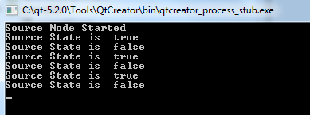
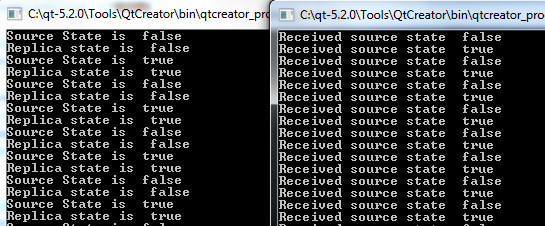

# Example 1: Direct Connection using a Static Source


1. Create a source object

   To create this [Source](https://doc.qt.io/qt-5/qtremoteobjects-source.html#source) object, first we create the definition file, `simpleswitch.rep`. This file describes the properties and methods for the object and is input to the Qt Remote Objects Compiler [repc](https://doc.qt.io/qt-5/qtremoteobjects-repc.html). This file only defines interfaces that are necessary to expose to the [Replicas](https://doc.qt.io/qt-5/qtremoteobjects-replica.html#replica).

   `simpleswitch.rep`

   ```rep
   class SimpleSwitch
   {
       PROP(bool currState=false);
       SLOT(server_slot(bool clientState));
   };
   ```

   In `simpleswitch.rep`,

   - `currState` holds the current state of the switch.
   - `server_slot()` allows us to interact with the source - it will be connected to the `echoSwitchState(bool newstate)` signal.

   For repc to process this file, add the following line to your `.pro` file:

   ```
   REPC_SOURCE = simpleswitch.rep
   ```

   The `REPC_SOURCE` variable is only relevant for the Qt Remote Object module, so you need to add it to your project as well:

   ```
   QT       += remoteobjects
   ```

   repc creates the `rep_SimpleSwitch_source.h` header in the build directory that you specify. For more information, see [Source](https://doc.qt.io/qt-5/qtremoteobjects-source.html#source).

   repc creates three helper classes for use with QtRO. For this example, we use the basic: `SimpleSwitchSimpleSource`. It's an abstract class, defined in `rep_SimpleSwitch_source.h`. We derive from it to define our SimpleSwitch implementation class as shown below:

   `simpleswitch.h`

   ```cpp
   #ifndef SIMPLESWITCH_H
   #define SIMPLESWITCH_H
   
   #include "rep_SimpleSwitch_source.h"
   
   class SimpleSwitch : public SimpleSwitchSimpleSource
   {
       Q_OBJECT
   public:
       SimpleSwitch(QObject *parent = nullptr);
       ~SimpleSwitch();
       virtual void server_slot(bool clientState);
   public Q_SLOTS:
       void timeout_slot();
   private:
       QTimer *stateChangeTimer;
   };
   
   #endif
   ```

   In `simpleswitch.h`,

   - `stateChangeTimer` is a [QTimer](https://doc.qt.io/qt-5/qtimer.html) that is used to toggle the state of our SimpleSwitch.
   - `timeout_slot()` is connected to `stateChangeTimer`'s timeout() signal.
   - `server_slot()` -- which is called automatically on the source whenever any replica calls their version of the slot -- outputs the received value.
   - `currStateChanged(bool)`, defined in the [repc](https://doc.qt.io/qt-5/qtremoteobjects-repc.html)-generated `rep_SimpleSwitch_source.h`, is emitted whenever `currState` toggles. In this example, we ignore the signal on the source side, and handle it later on the replica side.

   The definition of our `SwitchState` class is shown below:

   `simpleswitch.cpp`

   ```cpp
   #include "simpleswitch.h"
   
   // constructor
   SimpleSwitch::SimpleSwitch(QObject *parent) : SimpleSwitchSimpleSource(parent)
   {
       stateChangeTimer = new QTimer(this); // Initialize timer
       QObject::connect(stateChangeTimer, &SimpleSwitch::timeout, this, &SimpleSwitch::timeout_slot); // connect timeout() signal from stateChangeTimer to timeout_slot() of simpleSwitch
       stateChangeTimer->start(2000); // Start timer and set timout to 2 seconds
       qDebug() << "Source Node Started";
   }
   
   //destructor
   SimpleSwitch::~SimpleSwitch()
   {
       stateChangeTimer->stop();
   }
   
   void SimpleSwitch::server_slot(bool clientState)
   {
       qDebug() << "Replica state is " << clientState; // print switch state echoed back by client
   }
   
   void SimpleSwitch::timeout_slot()
   {
       // slot called on timer timeout
       if (currState()) // check if current state is true, currState() is defined in repc generated rep_SimpleSwitch_source.h
           setCurrState(false); // set state to false
       else
           setCurrState(true); // set state to true
       qDebug() << "Source State is "<<currState();
   
   }
   ```

2. Create a registry

   Because this example uses a direct connection between nodes, we can omit this step.

3. Create a host node

   The host node is created as shown below:

   ```
   QRemoteObjectHost srcNode(QUrl(QStringLiteral("local:switch")));
   ```

4. Host source object and remoting

   The following statements instantiate the [Source](https://doc.qt.io/qt-5/qtremoteobjects-source.html#source) object and pass it on to the host to enable "remoting", which is the process of making an object visible to the QtRO network:

   ```
   SimpleSwitch srcSwitch; // create simple switch
   srcNode.enableRemoting(&srcSwitch); // enable remoting
   ```

   The contents of `main.cpp` file that implements the steps described above are as follows:

   `main.cpp`

   ```cpp
   #include <QCoreApplication>
   #include "simpleswitch.h"
   
   int main(int argc, char *argv[])
   {
       QCoreApplication a(argc, argv);
   
       SimpleSwitch srcSwitch; // create simple switch
   
       QRemoteObjectHost srcNode(QUrl(QStringLiteral("local:switch"))); // create host node without Registry
       srcNode.enableRemoting(&srcSwitch); // enable remoting/sharing
   
       return a.exec();
   }
   ```

   Compile and run this source-side project. The output, without any replicas created, should look as shown below with the switch state toggling between `true` and `false` every two seconds.

   

The subsequent steps are for creating the replica side of the network, which in this example gets the state of switch from the [Source](https://doc.qt.io/qt-5/qtremoteobjects-source.html#source) and echoes it back.


### Replica Code

1. Use repc to add a replica to your project

   We use the same API definition file as we did on the source side, `SimpleSwitch.rep`, to create a [Replica](https://doc.qt.io/qt-5/qtremoteobjects-replica.html#replica) header file using the [repc](https://doc.qt.io/qt-5/qtremoteobjects-repc.html). Include the following line in your client side `.pro` file, specifying a `.rep` file input:

   ```
   REPC_REPLICA = simpleswitch.rep
   ```

   The [repc](https://doc.qt.io/qt-5/qtremoteobjects-repc.html) tool generates a `rep_SimpleSwitch_replica.h` file in the build directory. For more information, see [Replica](https://doc.qt.io/qt-5/qtremoteobjects-replica.html#replica).

2. Create a node to connect with the source's host node

   The following code instantiates the second node on the network and connects it with the source host node:

   ```
   QRemoteObjectNode repNode; // create remote object node
   repNode.connectToNode(QUrl(QStringLiteral("local:switch"))); // connect with remote host node
   ```

3. Call the node's [acquire()](https://doc.qt.io/qt-5/qremoteobjectnode.html#acquire) to create a pointer to a replica

   First, we instantiate a replica:

   ```
   QSharedPointer<SimpleSwitchReplica> ptr;
   ptr.reset(repNode.acquire<SimpleSwitchReplica>()); // acquire replica of source from host node
   ```

   **Note:** [acquire()](https://doc.qt.io/qt-5/qremoteobjectnode.html#acquire) returns a pointer to the replica, but doesn't manage its lifetime. This example shows the recommended process of wrapping the returned pointer in a [QSharedPointer](https://doc.qt.io/qt-5/qsharedpointer.html) or [QScopedPointer](https://doc.qt.io/qt-5/qscopedpointer.html) to ensure that the pointer is always deleted properly.

   `main.cpp` implements the steps described above and instantiates our object:

   `main.cpp`

   ```cpp
   #include <QCoreApplication>
   #include "client.h"
   
   int main(int argc, char *argv[])
   {
       QCoreApplication a(argc, argv);
   
       QSharedPointer<SimpleSwitchReplica> ptr; // shared pointer to hold source replica
   
       QRemoteObjectNode repNode; // create remote object node
       repNode.connectToNode(QUrl(QStringLiteral("local:switch"))); // connect with remote host node
   
       ptr.reset(repNode.acquire<SimpleSwitchReplica>()); // acquire replica of source from host node
   
       Client rswitch(ptr); // create client switch object and pass reference of replica to it
   
       return a.exec();
   }
   ```

   The complete declaration and definition for the `Client` class is as follows:

   `client.h`

   ```cpp
   #ifndef _CLIENT_H
   #define _CLIENT_H
   
   #include <QObject>
   #include <QSharedPointer>
   
   #include "rep_SimpleSwitch_replica.h"
   
   class Client : public QObject
   {
       Q_OBJECT
   public:
       Client(QSharedPointer<SimpleSwitchReplica> ptr);
       ~Client();
       void initConnections();// Function to connect signals and slots of source and client
   
   Q_SIGNALS:
       void echoSwitchState(bool switchState);// this signal is connected with server_slot(..) on the source object and echoes back switch state received from source
   
   public Q_SLOTS:
       void recSwitchState_slot(); // slot to receive source state
   private:
       bool clientSwitchState; // holds received server switch state
       QSharedPointer<SimpleSwitchReplica> reptr;// holds reference to replica
   
    };
   
   #endif
   ```

   `client.cpp`

   ```cpp
   #include "client.h"
   
   // constructor
   Client::Client(QSharedPointer<SimpleSwitchReplica> ptr) :
       QObject(nullptr),reptr(ptr)
   {
       initConnections();
       //We can connect to SimpleSwitchReplica Signals/Slots
       //directly because our Replica was generated by repc.
   }
   
   //destructor
   Client::~Client()
   {
   }
   
   void Client::initConnections()
   {
       // initialize connections between signals and slots
   
       // connect source replica signal currStateChanged() with client's recSwitchState() slot to receive source's current state
       QObject::connect(reptr.data(), &SimpleSwitchReplica::currStateChanged, this, &Client::recSwitchState_slot);
       // connect client's echoSwitchState(..) signal with replica's server_slot(..) to echo back received state
       QObject::connect(this, &Client::echoSwitchState, reptr.data(), &SimpleSwitchReplica::server_slot);
   }
   
   void Client::recSwitchState_slot()
   {
       qDebug() << "Received source state "<<reptr.data()->currState();
       clientSwitchState = reptr.data()->currState();
       Q_EMIT echoSwitchState(clientSwitchState); // Emit signal to echo received state back to server
   }
   ```

   Compiling and running this example together with the source-side example generates the following output:

   


© 2023 The Qt Company Ltd. Documentation contributions included herein are the copyrights of their respective owners. The documentation provided herein is licensed under the terms of the [GNU Free Documentation License version 1.3](http://www.gnu.org/licenses/fdl.html) as published by the Free Software Foundation. Qt and respective logos are [trademarks](https://doc.qt.io/qt/trademarks.html) of The Qt Company Ltd. in Finland and/or other countries worldwide. All other trademarks are property of their respective owners.