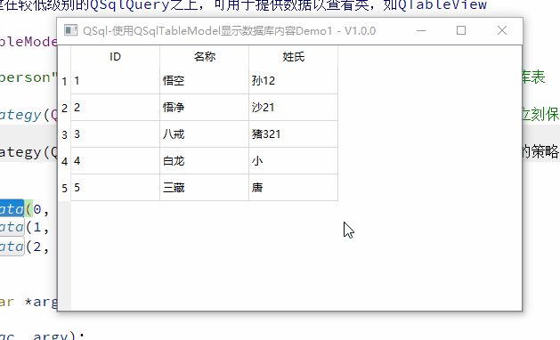

## Qt-数据库开发-QTableView操作数据库（1）

**mahuifa**

### Qt-数据库开发-QTableView操作数据库

**1、概述**
**2、实现效果**
**3、主要代码**
**4、完整源代码**


#### 1、概述

这是通过学习Qt官方Demo产生的一个示例；
通过自己理解加入了一些更加详细便于学习的内容；
添加了非常详细的注释信息，对于小白更加友好。
**开发环境说明**

系统：Windows10、Ubuntu20.04
Qt版本：V5.12.5
编译器：MSVC2017-64、GCC/G++64

#### 2、实现效果

> 1、 这个Demo中展示了如何使用具有表视图的专用 SQL 表模型（QSqlTableModel）来编辑数据库中的信息，使用QTableView显示和编辑；
>
> 2、程序启动时自动创建一个数据库，并创建一个表写入默认测试数据，可选择创建文件数据库还是内存数据库；
>
> 3、写入测试数据时演示了QSqlQuery的五种不同的插入数据方式；
>
> 4、只有一个main.cpp，十分简单便于学习。

实现效果如下：



#### 3、主要代码

- 啥也不说了，直接上代码，一切有注释

- pro文件： Qt使用到数据库，上来什么都别管，先在pro文件添加上QT += sql widgets；

- main.cpp文件：程序第一次启动时在main函数中创建数据库并写入数据，并通过QTableView显示数据库内容；

```cpp
#include <QApplication>
#include <QDebug>
#include <QMessageBox>
#include <QSqlDatabase>
#include <QSqlQuery>
#include <QSqlTableModel>
#include <QTableView>

/**
 * @brief  创建并打开一个QSqlite数据库，并创建一个测试表person，同时默认创建5组数据
 * @return
 */
bool createConnection()
{
    QSqlDatabase db = QSqlDatabase::addDatabase("QSQLITE");  // 使用数据库驱动（Qsqlite）和默认连接名称（qt_sql_default_connection）添加一个数据库
//    qDebug() << QSqlDatabase::defaultConnection;           // 打印默认数据库连接名称
#if 1
    db.setDatabaseName("test.db");        // 使用文件数据库（可生成数据库文件，数据一直有效）
#else
    db.setDatabaseName(":memory:");       // 使用内存数据库（不会生成数据库文件，所有数据都在内存中进行操作，性能强，程序退出后数据丢失）
#endif

    if(!db.open())             // 打开数据库
    {
        QMessageBox::critical(nullptr, "Error", "打开数据库失败！");
        return false;
    }

    QSqlQuery query;          // 创建一个用于执行和操作Sql语句的对象

    // 创建一个表person，包含id、firstname、lastname三个字段
    query.exec("create table person ("
               "id         int primary  key,"    // 索引
               "firstname  varchar(20),"         // 名
               "lastname   varchar(20))");       // 姓

    /****************** 向表中插入数据 ************************/

    // 插入方式一：直接插入数据
    query.exec("insert into person values(1, '悟空', '孙')");       // INSERT INTO 语法1（为表中所有项插入数据）

    // 插入方式二：使用命名占位符的[命名]绑定
    query.prepare("insert into person(id, firstname, lastname)"       // insert into 语法2
                  "values (:id, :firstname, :lastname)");
    query.bindValue(":id", 2);
    query.bindValue(":firstname", "悟净");
    query.bindValue(":lastname", "沙");
    query.exec();

    // 插入方式三：使用命名占位符的[位置]绑定
    query.prepare("insert into person(id, firstname, lastname)"       // insert into 语法2
                  "values (:id, :firstname, :lastname)");
    query.bindValue(0, 3);
    query.bindValue(1, "八戒");
    query.bindValue(2, "猪");
    query.exec();

    // 插入方式四：使用位置占位符绑定值（版本 1）
    query.prepare("insert into person(id, firstname, lastname)"       // insert into 语法2
                  "values (?, ?, ?)");
    query.bindValue(0, 4);
    query.bindValue(1, "白龙");
    query.bindValue(2, "小");
    query.exec();

    // 插入方式五：使用位置占位符绑定值（版本 2）
    query.prepare("insert into person(id, firstname, lastname)"       // insert into 语法2
                  "values (?, ?, ?)");
    query.addBindValue(5);                                           // 使用位置值绑定时，将值val添加到值列表中。addBindValue（）调用的顺序决定了在准备好的查询中将值绑定到哪个占位符
    query.addBindValue("三藏");
    query.addBindValue("唐");
    query.exec();

    return true;
}

/**
 * @brief        初始化用于操作显示数据库的Model
 * @param model  QSqlTableModel是一个高级接口，用于从单个表读取和写入数据库记录。
 *               它构建在较低级别的QSqlQuery之上，可用于提供数据以查看类，如QTableView
 */
void initModel(QSqlTableModel* model)
{
    model->setTable("person");                                // 设置需要显示的数据库表
#if 1
    model->setEditStrategy(QSqlTableModel::OnFieldChange);    // 在界面上修改后数据立刻保存到数据库
#else
    model->setEditStrategy(QSqlTableModel::OnManualSubmit);   // 将将编辑数据库中值的策略设置为[在调用 submitAll() 或 revertAll() 之前，所有更改都将缓存在模型中（即在界面上修改数据后不会立刻存入数据库）]
#endif
    model->select();                                         // 获取数据库中的数据
    model->setHeaderData(0, Qt::Horizontal, "ID");
    model->setHeaderData(1, Qt::Horizontal, "名称");
    model->setHeaderData(2, Qt::Horizontal, "姓氏");
}

int main(int argc, char *argv[])
{
    QApplication a(argc, argv);

    if(!createConnection()) return -1;

    QSqlTableModel model;                                   // 创建一个 单个数据库表的可编辑数据模型
    initModel(&model);

    QTableView *view = new QTableView;                      // 创建一个用于显示表的视图实现（由于是基于QWidget的，所以可以直接显示）
    view->resize(400, 300);                                 // 设置窗口大小
    view->setWindowTitle("");
    view->setWindowTitle(QString("QSql-使用QSqlTableModel显示数据库内容Demo1 - V%1").arg(APP_VERSION));
    view->setModel(&model);                                 // 设置需要显示的表model
    view->show();

    return a.exec();
}
```


#### 4、完整源代码

github(https://gitcode.net/mirrors/mahuifa/qmdemo?utm_source=csdn_github_accelerator)
gitee(https://gitee.com/mahuifa/QMDemo)
